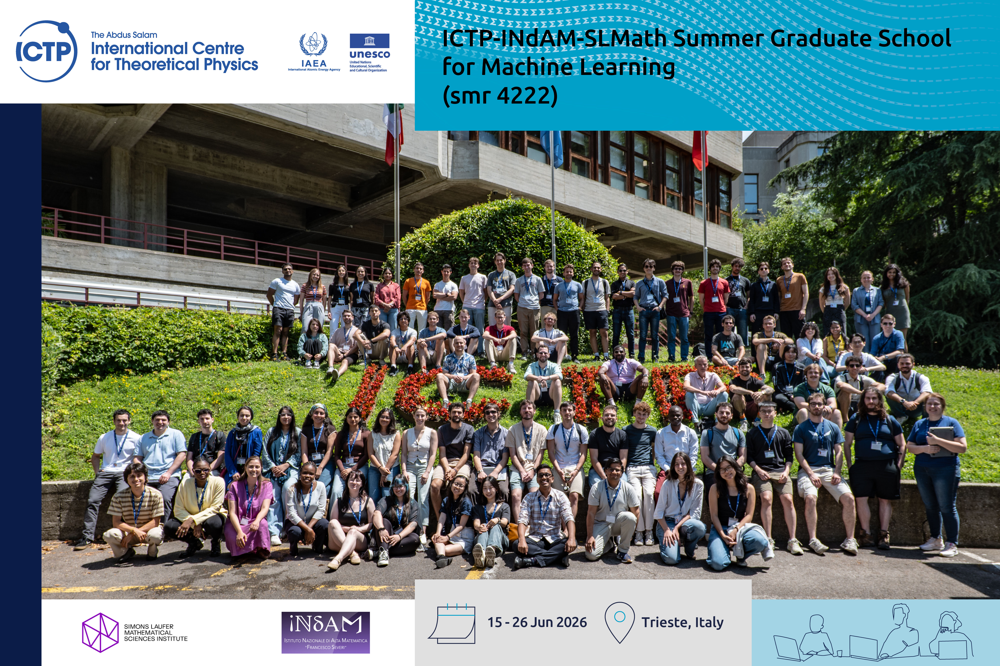
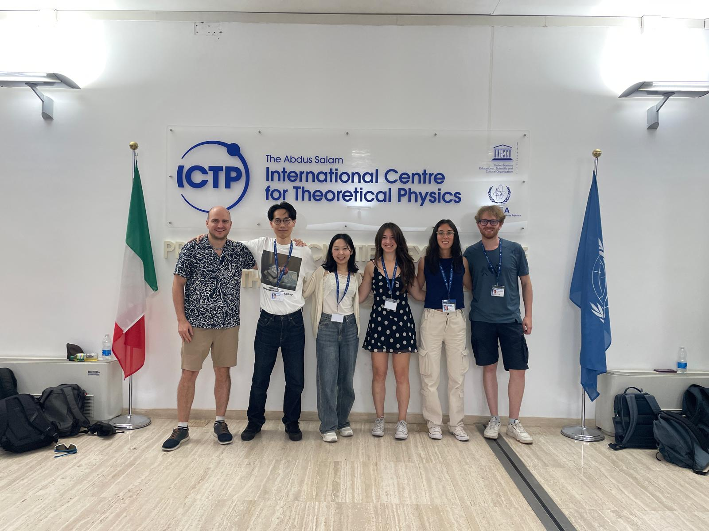
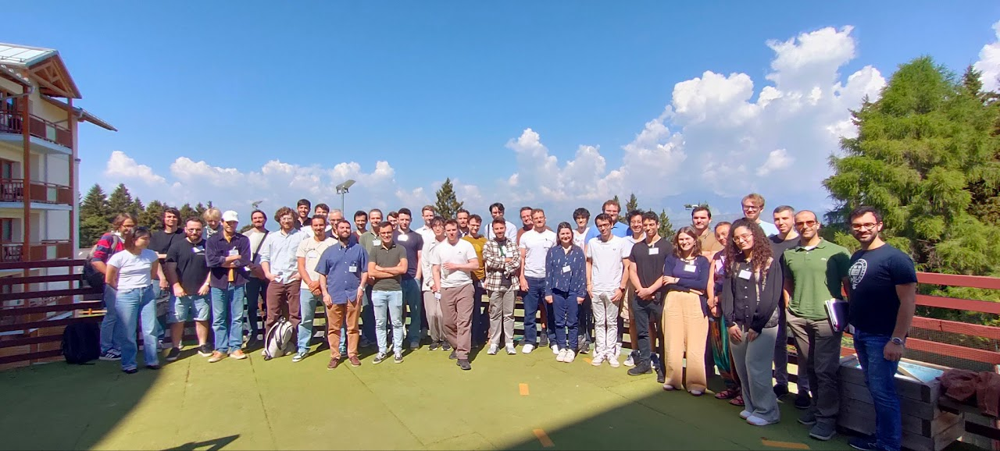

<h1> Bio </h1>
I am a PhD student in Mathematics at the University of Modena and Reggio Emilia (UNIMORE), working on numerical methods for kinetic equations and machine learning applied to mathematical models.
I hold a Master’s degree in Applied Mathematics from Sapienza University of Rome (110/110 cum laude), with a curriculum focused on data science, cryptography, and computational mathematics, and I have experience as both a university tutor and an active member of student aerospace projects involving computer vision, UAV design, and scientific software development.

<a href="./assets/CVshort.pdf" download class="btn btn-primary">Download short CV</a>
<a href="./assets/CVfull.pdf" download class="btn btn-primary">Download full CV</a>

```{=html}
<h1> Events </h1>
<div class="accordion" id="accordion-events">
  <div class="accordion-item">
    <h2 class="accordion-header" id="heading3">
      <button class="accordion-button" type="button" data-bs-toggle="collapse" data-bs-target="#collapse3" aria-expanded="true" aria-controls="collapse3">
        SLMath Summer Graduate School for Machine Learning
      </button>
    </h2>
    <div id="collapse3" class="accordion-collapse collapse show" aria-labelledby="heading3" data-bs-parent="#accordion-events", style="">
      <div class="accordion-body">
        <center>
        <strong>2026, Trieste (Italy)</strong>
        <br>
        <br>
        <b>Lecturers:</b><br>
            Andrea Montanari<br>
            Basil Saeed<br>
            Davide Ghio<br>
            Francesca Mignacco<br>
        <hr>
        <p margin-bottom=3rem><b>WebPage:</b><br><a href=https://indico.ictp.it/event/11148>https://indico.ictp.it/event/11148</a><br></p>
        <a href="./assets/Trieste26/certificate.pdf" download class="btn btn-primary">Download Certificate</a>
        <a href="./assets/Trieste26/poster.pdf" download class="btn btn-primary">Download Poster</a>
        <a href="./wiki/library/PLKZ2022/index.html" class="btn btn-primary" role="button">See workshop</a>
        </center>
      </div>
    </div>
  </div>
  <div class="accordion-item">
    <h2 class="accordion-header" id="heading2">
      <button class="accordion-button collapsed" type="button" data-bs-toggle="collapse" data-bs-target="#collapse2" aria-expanded="false" aria-controls="collapse2">
        Methods and Models of Kinetic Theory
      </button>
    </h2>
    <div id="collapse2" class="accordion-collapse collapse" aria-labelledby="heading2" data-bs-parent="#accordion-events", style="">
      <div class="accordion-body">
        <center>
        <strong>2026, Pesaro (Italy)</strong>
        <hr>
        <b>Lecturers:</b><br>
            François Golse<br>
            Mikaela Iacobelli<br>
            Qin Li<br>
            Nilanjana Datta<br>
            Alessia Nota<br>
            Lorenzo Pareschi<br>
        <hr>
        <p margin-bottom=3rem><b>WebPage:</b><br><a href=https://mat521.unime.it/~webmama/MMKT/enter.php>https://mat521.unime.it/~webmama/MMKT/enter.php</a><br></p>
        <a href="./assets/Pesaro26/certificate.pdf" download class="btn btn-primary">Download Certificate</a>
        <a href="./assets/Pesaro26/poster.pdf" download class="btn btn-primary">Download Poster</a>
        </center>
      </div>
    </div>
  </div>
  <div class="accordion-item">
    <h2 class="accordion-header" id="heading1">
      <button class="accordion-button collapsed" type="button" data-bs-toggle="collapse" data-bs-target="#collapse1" aria-expanded="false" aria-controls="collapse1">
        Mathematical Foundations of Machine Learning
      </button>
    </h2>
    <div id="collapse1" class="accordion-collapse collapse" aria-labelledby="heading1" data-bs-parent="#accordion-events", style="">
      <div class="accordion-body">
        <center>
        <strong>2026, Trento (Italy)</strong><br>
        <br>
        <b>Lecturers:</b><br>
            Lénaïc Chizat<br>
            Nicolás García-Trillos<br>
            Guido Montúfar<br>
            Enrique Zuazua<br>
        <hr>
         <p margin-bottom=3rem><b>WebPage:</b><br><a href=https://sites.google.com/unitn.it/mfml-2026/>https://sites.google.com/unitn.it/mfml-2026/</a><br></p>
        <a href="./assets/Trento26/certificate.pdf" download class="btn btn-primary">Download Certificate</a>
        </center>
      </div>
    </div>
  </div>
  <div class="accordion-item">
    <h2 class="accordion-header" id="heading0">
      <button class="accordion-button collapsed" type="button" data-bs-toggle="collapse" data-bs-target="#collapse0" aria-expanded="false" aria-controls="collapse0">
        DataHyKing Workshop
      </button>
    </h2>
    <div id="collapse0" class="accordion-collapse collapse" aria-labelledby="heading0" data-bs-parent="#accordion-events", style="">
      <div class="accordion-body">
        <center>
        <strong>2026, Ferrara (Italy)</strong>
        <hr>
        <b>Speakers:</b><br>
            Walter Boscheri<br>
            Nicolas Crouseilles<br>
            Qin Li<br>
            Laurent Navoret<br>
            Giacomo Dimarco<br>
            Giovanni Russo<br>
        <hr>
        <b>WebPage:</b><br><a href=https://sites.google.com/unife.it/datahykingevent>https://sites.google.com/unife.it/datahykingevent</a>
        </center>
      </div>
    </div>
  </div>
</div>
```