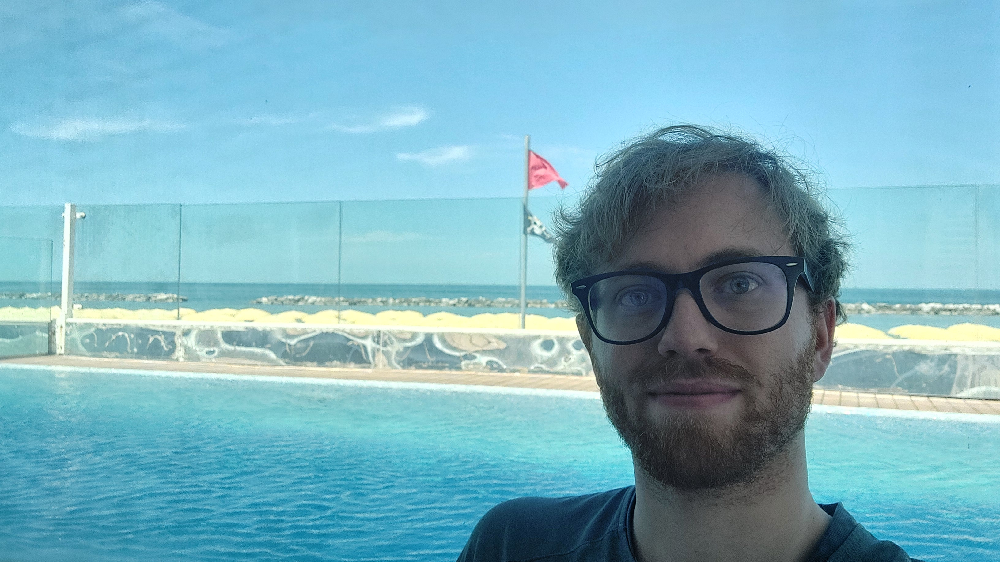

```{=html}
<div class="card border-primary mb-3" style="max-width: 70ch;">
  <div class="card-header">My Profile</div>
  <div class="card-body">
          
      <p class="card-text">
      I am a PhD student in Mathematics at the <a href="https://www.unimore.it/">University of Modena and Reggio Emilia</a>, working at the application of Computer Science in Numerical Analysis (MSC 65–68).
      My research focuses on the application of machine learning to mathematical models, with a current focus on the analysis of multilayer perceptron (MLP) networks for Fokker–Planck equations.
    </p>
    <ul class="list-group list-group-flush">
      <li class="list-group-item">
        <b>Contact</b>:<br><a href="mailto:stefano.magrinialunno@unimore.it">stefano.magrinialunno@unimore.it</a>
      </li>
      <li class="list-group-item">
        <b>Institutional page</b>:<br><a href="https://unimore.unifind.cineca.it/resource/person/305272" class="card-link">https://unimore.unifind.cineca.it/resource/person/305272</a>
      </li>
      <li class="list-group-item">
        <b>Lorenzo Pareschi WebPage (PhD advisor)</b>:<br><a href="https://lorenzopareschi.blogspot.com/" class="card-link">https://lorenzopareschi.blogspot.com/</a>
      <li class="list-group-item">
        <b>Gabriella Anna Puppo WebPage (MSc advisor)</b>:<br><a href="http://gabriellapuppo.it/" class="card-link">http://gabriellapuppo.it/</a>
      </li>
    </ul>
  </div>
</div>
```

<!-- 
# This site
:::{.custom-card}
Brief description of the site and of its main sections, currently centered on Wiki and Notebooks.

- **Featured content**  
  - Latest uploads from the main sections of the site

- **News and events**  
  - Conferences, summer schools, workshops, talks, and other academic activities
:::
-->
